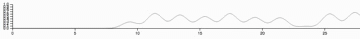

# Real Time Line with D3.js



## Usage

### index.html

```html
<script src="http://d3js.org/d3.v3.min.js"></script>
<script src="real_time_line.js"></script>
<script src="app.js"></script>
```

### app.js

	function DataProvider(){
	    var data = [];
	    setInterval(function(){
	      data.push(Math.sqrt(Math.random()));
	    }, 1000);
	    this.shift = function(){
	        return data.shift();
	    }
	}
	
	var dataProvider = new DataProvider();
	var realTimeLine = new RealTimeLine(dataProvider, {resolution: 30});
	realTimeLine.tick();

## License

See [MIT-LICENSE](LICENSE).
